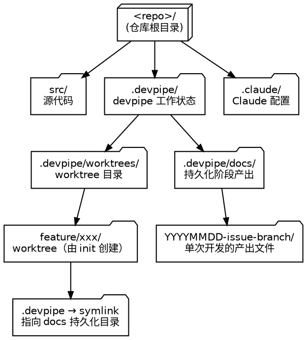
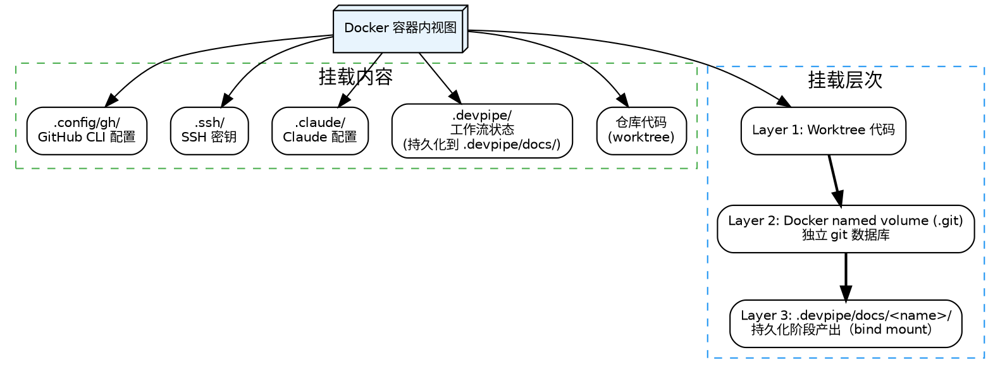

# GitHub 项目 Docker 开发环境初始化

为当前 GitHub 项目创建隔离的 worktree 分支，启动 Docker 容器提供一致的构建环境，并通过 tmux 双 Panel 连接容器。

完成后用户手动切换到新环境：
- **新功能**类型：执行 `/devpipe:discuss` 开始讨论需求
- **Bugfix / 优化重构**类型：执行 `/devpipe:design` 直接进行方案设计

## 执行流程

### 步骤 1：收集基本信息

使用 `AskUserQuestion` 询问 GitHub Issue 和开发分支（2 个 question 放在同一次调用中）：

```json
{
  "questions": [
    {
      "question": "GitHub Issue 编号或链接？（将自动从 Issue 获取开发类型和功能描述）",
      "header": "Issue",
      "options": [
        {"label": "跳过", "description": "不关联 Issue，后续手动输入开发信息"},
        {"label": "请在 Other 中输入", "description": "输入 Issue 编号（如 #42 或 42）或 Issue 链接"}
      ],
      "multiSelect": false
    },
    {
      "question": "基于哪个分支开发？",
      "header": "开发分支",
      "options": [
        {"label": "main", "description": "基于 main 分支开发（默认）"},
        {"label": "使用当前分支", "description": "基于当前本地分支开发（包含未推送的提交）"},
        {"label": "请在 Other 中输入", "description": "输入分支名，如 develop（本地分支）或 origin/release-1.0（远程分支）"}
      ],
      "multiSelect": false
    }
  ]
}
```

### 步骤 2：获取开发信息

根据用户是否提供了 GitHub Issue 编号，走不同的路径：

#### 路径 A：用户提供了 GitHub Issue 编号

**2A-1. 格式校验与标准化**

接受以下三种输入格式，统一提取 Issue 编号：

- **带 # 号**（如 `#42`）：提取数字部分 `42`
- **纯数字**（如 `42`）：直接使用
- **GitHub 链接**（如 `https://github.com/owner/repo/issues/42`）：从 URL 路径中提取 Issue 编号

**2A-2. 查询 Issue 信息**

使用 `gh` CLI 查询 Issue 详情：

```bash
gh issue view <number> --json title,body,labels,state,url
```

从返回结果中提取：
- `title`：Issue 标题
- `body`：Issue 正文（Markdown 格式，无需转换）
- `labels`：标签列表（用于映射开发类型）
- `url`：Issue 完整 URL

**2A-3. 自动映射开发类型**

根据 Issue 标签自动推断开发类型：

| 标签 | 开发类型 |
|------|---------|
| bug | Bugfix |
| feature, enhancement | 新功能 |
| refactor, chore | 优化重构 |
| 无匹配标签 | 根据标题判断：包含"重构""优化""清理""refactor"等关键词 → 优化重构，包含"fix""bug""error"等 → Bugfix，否则 → 需要询问用户 |

**2A-4. 使用 Issue 标题作为功能描述**

直接使用 Issue 的 `title` 字段作为功能描述，用于生成本地分支名。

**2A-5. 信息不够清晰时的补充询问**

以下情况需要通过 `AskUserQuestion` 向用户补充确认：

- **标签无法映射开发类型**：询问开发类型（新功能/优化重构/Bugfix）
- **Issue 标题过于简短**（少于 4 个字符）或过于模糊：询问更具体的功能描述

补充询问只针对缺失的信息，不要重复询问已经能从 Issue 获取的信息。

**2A-6. 向用户展示自动获取的信息**

在继续执行前，向用户展示从 Issue 获取的信息摘要（不需要用户确认，仅作信息展示）：

```
从 GitHub Issue #XX 获取到以下信息：
  标题: <Issue 标题>
  标签: <标签列表> → 开发类型: <映射后的开发类型>
  功能描述: <用于分支命名的描述>
  正文: <Markdown 内容按需展示>
```

**正文展示规则：**
- 如果正文内容 ≤ 200 字符：完整展示
- 如果正文内容 > 200 字符：展示前 200 字符 + "...（共 X 字符，完整内容将在 discuss 阶段参考）"

#### 路径 B：用户跳过 GitHub Issue

回退到手动收集模式，使用 `AskUserQuestion` 询问：

```json
{
  "questions": [
    {
      "question": "这次开发的类型是什么？",
      "header": "开发类型",
      "options": [
        {"label": "新功能", "description": "全新的功能开发"},
        {"label": "优化重构", "description": "现有功能的改进或代码重构"},
        {"label": "Bugfix", "description": "修复已知问题"}
      ],
      "multiSelect": false
    },
    {
      "question": "请简要描述要开发的功能（用于生成分支名）？",
      "header": "功能描述",
      "options": [
        {"label": "请在 Other 中输入", "description": "输入简短的功能描述，如：add user authentication"},
        {"label": "暂时跳过", "description": "使用默认名称，后续可修改"}
      ],
      "multiSelect": false
    }
  ]
}
```

### 步骤 3：验证开发分支

分支操作针对当前仓库：

- 如选「main」：mode 设为 `remote`，base-branch 为 `main`
- 如选「使用当前分支」：执行 `git branch --show-current` 获取当前分支名，mode 设为 `local`
- 如用户手动输入了分支名：
  - 以 `origin/` 开头（如 `origin/release-1.0`）：mode 设为 `remote`，去掉 `origin/` 前缀作为 base-branch
  - 不以 `origin/` 开头（如 `develop`）：mode 设为 `local`，直接使用输入值作为 base-branch

**本地分支命名规则：** 根据开发类型选择前缀，kebab-case，3-4 个单词以内。

| 开发类型 | 前缀 | 示例 |
|---------|------|------|
| 新功能 | `feature/` | `feature/add-cluster-api` |
| Bugfix | `fix/` | `fix/conn-leak` |
| 优化重构 | `refactor/` | `refactor/broker-ops` |

### 步骤 4：执行初始化脚本

运行 `scripts/init-env.sh` 完成环境创建：

```bash
bash ${CLAUDE_PLUGIN_ROOT}/skills/init/scripts/init-env.sh <local-branch-name> <base-branch> <mode> "${CLAUDE_PLUGIN_ROOT}" "<issue-number>"
```

**⚠️ 重要：必须使用相对路径，且从仓库根目录运行**

脚本路径必须使用相对于仓库根目录的相对路径（如上所示），**不要使用全路径**（如 `/Users/xxx/.claude/plugins/...`），因为工具白名单配置的是相对路径模式，全路径会导致权限匹配失败。

参数说明：
- `<local-branch-name>`: 新建的本地分支名
- `<base-branch>`: 基础分支名
- `<mode>`: `local`（基于本地分支）或 `remote`（基于远程分支）
- `"${CLAUDE_PLUGIN_ROOT}"`: devpipe 仓库路径（用于查找镜像构建脚本）
- `"<issue-number>"`: 步骤 2 收集到的 Issue 编号，无 Issue 时传空字符串 `""`

脚本会自动完成：
- 前置检查（docker、git、gh 是否安装，Docker daemon 是否运行）
- 冲突检测（worktree/分支/容器名是否已存在）
- 脏工作区检测
- 分支验证（local 模式验证本地分支存在，remote 模式 fetch 并验证远程分支存在）
- 创建 worktree（位于 `.devpipe/worktrees/<branch-name>`）
- 构建 Docker 镜像（查找项目内 Dockerfile 或使用通用镜像）
- 创建 Docker 容器：
  - 挂载仓库 worktree 代码
  - 挂载 `.devpipe` 目录
  - 挂载 SSH 密钥和 gh CLI 配置
  - Docker named volume 挂载到 `.git`（独立 git 数据库）
  - 初始化容器内 git 环境（checkout 到开发分支）
- 创建 tmux session（左 Panel: 容器内 Shell，右 Panel: 容器内 Claude Code）

脚本成功后会输出：
- Worktree 路径（`Worktree: <path>`）
- Docker 容器名（`Container: <name>`）
- Docs 持久化路径（`Devpipe Docs: <path>`）

### 步骤 5：编译验证

在 Docker 容器内执行编译验证。根据项目构建系统自动检测：

| 检测文件 | 构建命令 |
|---------|---------|
| `pom.xml` | `docker exec <container-name> mvn compile -T 1C -q` |
| `package.json` | `docker exec <container-name> sh -c "npm install && npm run build"` |
| `go.mod` | `docker exec <container-name> go build ./...` |
| `Cargo.toml` | `docker exec <container-name> cargo check` |
| 无构建系统 | 跳过编译验证 |

如果编译失败，输出错误信息并提示用户排查问题。提供清理指引：
```
编译失败，可执行以下命令清理环境后重试：
  bash skills/init/scripts/cleanup-env.sh <local-branch-name>
```

> **注意**：同样使用相对路径，不要使用全路径。

### 步骤 6：写入开发上下文

将收集的信息写入 worktree 根目录的 `.devpipe/context.json`，供后续 skill 自动读取，避免用户重复输入：

`.devpipe/` 目录已由 `init-env.sh` 脚本自动创建，直接写入配置文件：

```json
{
  "stage": "init",
  "stage_completed": true,
  "dev_type": "<开发类型>",
  "description": "<功能描述>",
  "github_issue": "<Issue编号，跳过时为空字符串>",
  "github_issue_title": "<Issue标题，跳过时为空字符串>",
  "github_issue_body": "<Issue正文（Markdown），跳过时为空字符串>",
  "github_issue_url": "<Issue完整URL，跳过时为空字符串>",
  "github_repo": "<owner/repo格式>",
  "remote_branch": "<远程分支>",
  "local_branch": "<本地分支名>",
  "container_name": "<Docker 容器名>",
  "repo_root": "<仓库根目录绝对路径>",
  "worktree_path": "<worktree 绝对路径>",
  "docs_path": "<.devpipe/docs/YYYYMMDD-issueNum-branchName/ 的绝对路径>",
  "created_at": "<YYYY-MM-DDTHH:MM:SS+08:00>"
}
```

**字段说明：**
- `stage`：当前所在阶段，可选值为 `init`、`discuss`、`design`、`coding`、`review-and-fix`、`summarize`、`done`，每个 skill 在执行时会更新此字段
- `stage_completed`：当前阶段是否已完成（`true`/`false`）。`false` 表示阶段正在进行中，`true` 表示阶段已完成可进入下一阶段。init 阶段在写入 context.json 时工作（环境创建）已完成，故直接标记为 `true`
- `remote_branch`：PR 的目标分支（即基础分支，如 `main`），用于 `gh pr create --base` 参数
- `local_branch`：本地功能分支名（如 `feature/add-cluster-api`），用于 `git push origin HEAD:<local_branch>` 推送
- `github_repo`：通过 `gh repo view --json nameWithOwner -q .nameWithOwner` 获取
- `docs_path`：从 init-env.sh 输出的 `Devpipe Docs:` 行捕获，为 `.devpipe/docs/YYYYMMDD-issueNum-branchName/` 的绝对路径

直接使用 `Write` 工具将文件写入 `<worktree-path>/.devpipe/context.json`（目录已由 init-env.sh 创建，无需再调 mkdir）。

### 步骤 7：输出结果

脚本执行成功后，输出以下信息并**结束本 Skill**：

```
开发环境已创建完成!

开发类型: <新功能/优化重构/Bugfix>
功能描述: <用户输入的功能描述>
本地分支: <local-branch-name>
远程分支: <remote-branch>
Worktree: <worktree-path>
Docker 容器: <container-name>
GitHub Issue: #<编号> 或 "提交时填写"

进入开发环境:
  tmux attach -t <local-branch-name>

布局:
  左 Panel: 容器内 Shell
  右 Panel: 容器内 Claude Code 对话框（已自动打开）

进入后请在右 Panel 执行下一步：
  新功能类型 → /devpipe:discuss 讨论需求
  Bugfix/优化重构类型 → /devpipe:design 制定方案
开发信息已自动保存，无需重复输入。
```

---

## 环境清理

如需删除开发环境，执行清理脚本：

```bash
bash ${CLAUDE_PLUGIN_ROOT}/skills/init/scripts/cleanup-env.sh <branch-name>
```

> **注意**：必须使用相对路径，从仓库根目录运行，不要使用全路径。

脚本会按顺序自动清理：Docker 容器 → Docker volume → tmux session → worktree → 本地分支。

## 架构说明

### 仓库目录结构



### Docker 容器内挂载层次



## 常见问题

| 问题 | 解决方案 |
|------|---------|
| 查看已有环境 | `git worktree list` + `docker ps --filter "name=feature-"` |
| 查看所有容器（含已停止） | `docker ps -a` |
| Panel 间切换 | `Ctrl+B` 然后 `←`/`→` |
| 退出 Session（保持运行） | `Ctrl+B` 然后 `D` |
| 手动进入容器 Shell | `docker exec -it <container-name> bash` |
| 右 Panel Claude Code 意外退出 | 执行 `unset CLAUDECODE && Claude Code` |
| 容器内 `gh` 报 HTTP 401 | gh token 过期，在容器内或宿主机执行 `gh auth login -h github.com` 重新认证 |
| 容器内 git 操作 | 正常使用 git（独立 .git，不影响宿主机） |

## 参考文档

- [Git 命令参考](../../references/git_commands.md)
- [GitHub Issue 使用指南](../../references/github_issue_guide.md)
