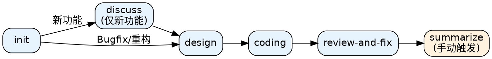
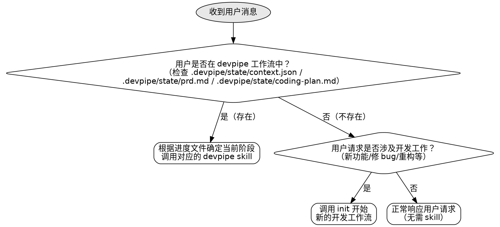

# 使用 Devpipe 工作流

本 skill 是 devpipe 插件的入口调度器。它确保每个用户请求都经过 skill 适用性检查，并在合适时自动调用对应的 devpipe skill。

<subagent-stop-gate>
如果你是作为 subagent 被派遣执行特定任务的，**跳过本 skill 的所有规则**，直接执行你被分配的任务。subagent 上下文是独立的、任务导向的，不需要 skill 检查。
</subagent-stop-gate>

---

<EXTREMELY-IMPORTANT>

## 核心规则：必须先检查 Skill

**在对每个用户消息做出任何响应之前**，你必须：

1. 检查用户的请求是否可能与 devpipe skill 相关
2. 如果有 **哪怕 1%** 的可能性某个 skill 适用，**必须调用它**
3. 这不是建议，不是可选项，是强制要求

### Devpipe Skills 列表

**工作流阶段（严格顺序执行）：**

| Skill | 触发场景 | 产出 |
|-------|----------|------|
| `devpipe:init` | 开始开发、创建分支、初始化环境、"帮我开个环境"、"准备开发" | `.devpipe/state/context.json` |
| `devpipe:discuss` | 讨论需求（仅新功能）、"聊聊需求"、"我想做一个新功能" | `.devpipe/state/prd.md` |
| `devpipe:design` | 拆分任务、制定计划、分析 Bug、设计重构方案、"怎么实现"、"写个计划" | `.devpipe/state/coding-plan.md + task-progress.md` |
| `devpipe:coding` | 写代码、继续开发、"接着做"、"从上次继续" | 代码 commit（不 push） |
| `devpipe:review-and-fix` | 评审代码、推送代码、"review"、"push"、"自检" | 代码推送到 GitHub + PR |
| `devpipe:summarize` | 总结归档、"summarize"、"代码已合入"、"归档" | `docs/` 下迭代文档 |

**辅助型 skill（可独立调用）：**

| Skill | 触发场景 | 产出 |
|-------|----------|------|
| `devpipe:code-reviewer` | "评审代码"、"review 代码"、"检查代码"、"code-reviewer" | Fix Plan JSON |
| `devpipe:code-fixer` | "修复这些问题"、"按计划修复"、"code-fixer" | 修复报告 |

> **备注**：
> - `devpipe:code-reviewer` 和 `devpipe:code-fixer` 是辅助型 skill，可在任何时候独立调用。`code-reviewer` 的输出（Fix Plan JSON）可直接作为 `code-fixer` 的输入，形成 `code-reviewer → code-fixer` 链式调用。`devpipe:review-and-fix` 是主工作流的阶段（coding 之后），内联了评审和修复流程，同时也可在工作流外独立调用。

### 工作流顺序

devpipe 根据 `dev_type` 走不同的工作流路径：



- 每个阶段有明确的前置条件和产出物
- **新功能**类型走完整流程：init → discuss → design → coding → review-and-fix → summarize
- **Bugfix / 优化重构**类型跳过 `discuss` 阶段，init 后直接进入 design
- `coding` 完成后自动调用 `review-and-fix`
- `review-and-fix` 完成后由用户手动触发 `summarize`

</EXTREMELY-IMPORTANT>

---

## 决策流程图



---

## 自动阶段检测

当检测到 `.devpipe/state/context.json` 存在时，读取其中的 `stage`、`stage_completed` 和 `dev_type` 字段确定当前阶段和完成状态：

### 二维路由表（stage + stage_completed）

| `stage` | `stage_completed` | 动作 |
|---------|-------------------|------|
| `init` | `true` | 读取 `dev_type`：新功能 → `devpipe:discuss`；Bugfix/优化重构 → `devpipe:design` |
| `init` | `false` | 调用 `devpipe:init`（继续/重试） |
| `discuss` | `true` | 调用 `devpipe:design` |
| `discuss` | `false` | 调用 `devpipe:discuss`（继续） |
| `design` | `true` | 调用 `devpipe:coding` |
| `design` | `false` | 调用 `devpipe:design`（继续） |
| `coding` | `true` | 调用 `devpipe:review-and-fix` |
| `coding` | `false` | 调用 `devpipe:coding`（继续） |
| `review-and-fix` | `true` | 提示用户等待 CR 合入后执行 `/devpipe:summarize` |
| `review-and-fix` | `false` | 调用 `devpipe:review-and-fix`（继续） |
| `summarize` | `true` 或 `false` | 调用 `devpipe:summarize`（继续） |
| `done` | `true` | 提示用户：工作流已结束，如需新任务请执行 `/devpipe:init` |

### 向后兼容

**`stage_completed` 字段缺失时视为 `true`**，与旧版路由行为一致（假设阶段已完成，路由到下一阶段）。

### 文件存在性回退判断

如果 `stage` 字段缺失，按文件存在性和 `dev_type` 回退判断：

| 状态 | 调用 |
|------|------|
| 只有 `.devpipe/state/context.json`，`dev_type` 为新功能 | `devpipe:discuss` |
| 只有 `.devpipe/state/context.json`，`dev_type` 为 Bugfix/优化重构 | `devpipe:design` |
| 有 `context.json` + `prd.md` | `devpipe:design` |
| 有 `context.json` + `coding-plan.md` | `devpipe:coding` |

> **重要**：如果用户说"继续"、"接着做"、"从上次继续"，直接根据 stage 和 stage_completed 字段调用对应 skill，不要询问。

---

## 红线清单：不要用这些借口跳过 Skill

| 常见推诿 | 为什么是错的 | 正确做法 |
|----------|--------------|----------|
| "这只是个简单问题" | 简单问题也可能是开发流程的一部分 | 先检查状态文件，再决定 |
| "我需要先了解更多" | skill 本身会引导信息收集 | 调用 skill，让它来询问 |
| "用户没有明确说要开发" | 很多表述都暗示开发意图 | 识别隐含意图，主动询问 |
| "这个 skill 太重了" | skill 会根据复杂度自适应 | 调用它，它知道怎么简化 |
| "让我先直接回答" | 绕过 skill = 绕过工作流保障 | 永远先检查 skill |
| "用户可能只是想聊聊" | 即使是"聊聊需求"也应触发 discuss | 触发 skill，它比你更懂处理 |

---

## 触发词识别

以下用户表述应立即触发对应 skill：

### devpipe:init 触发词
- "开始开发"、"新功能"、"创建分支"、"开个环境"
- "初始化"、"准备开发"、"开新分支"
- "我要开发..."、"帮我准备..."

### devpipe:discuss 触发词
- "讨论一下需求"、"聊聊需求"、"新功能需求"
- "我想做一个新功能..."、"帮我分析需求..."
- **注意**：discuss 仅适用于「新功能」类型，Bugfix 和重构不走 discuss

### devpipe:design 触发词
- "拆分任务"、"制定计划"、"写个计划"
- "怎么分步骤"、"实施方案"、"设计方案"
- "这个怎么实现"、"分析一下怎么修"、"重构方案"
- **注意**：Bugfix 和重构从 init 直接进入 design，不经过 discuss

### devpipe:coding 触发词
- "开始写代码"、"coding"、"继续开发"
- "接着做"、"从上次继续"、"恢复开发"
- "继续上次的任务"

### devpipe:review-and-fix 触发词
- "review"、"评审"、"推送代码"、"push"、"自检"
- "评审并修复"、"review and fix"、"review-and-fix"
- "检查并修复"、"帮我 review 然后修复"

### devpipe:summarize 触发词
- "总结"、"归档"、"summarize"
- "代码已合入"、"开发完成了"、"收尾"

### devpipe:code-reviewer 触发词（辅助型）
- "评审代码"、"review 代码"、"检查代码"、"code-reviewer"
- "评审本次改动"、"review 最近提交"、"review this commit"
- "跑一下代码评审"、"帮我看看代码"、"评审 <commit>"

### devpipe:code-fixer 触发词（辅助型）
- "修复这些问题"、"按计划修复"、"fix these issues"
- "处理评审反馈"、"code-fixer"、"修复代码"
- "按 Fix Plan 修复"、"执行修复计划"

---

## Skill 调用方式

使用 `Skill` 工具调用 devpipe skill：

```
Skill 工具参数：
- skill: "devpipe:init"   # 或 discuss/design/coding/review-and-fix/summarize
```

---

## 不需要 Skill 的场景

以下场景可以不调用 devpipe skill：

- 纯知识问答（"什么是 Docker"）
- 代码解释请求（"这段代码是什么意思"）
- 与开发工作流无关的技术讨论
- 用户明确表示不使用 devpipe 流程

**但是**：如果有任何疑问，倾向于调用 skill。多调用一次 skill 的代价很小，漏掉一次 skill 可能导致工作流混乱。

---

## 宣告规则

当调用 devpipe skill 时，先向用户宣告：

> "检测到这是一个开发任务，使用 devpipe:[阶段名] 来处理。"

或者在恢复工作流时：

> "检测到未完成的开发进度，使用 devpipe:[阶段名] 继续。"

---

## 总结

1. **每个请求都要检查** - 是否存在状态文件？是否涉及开发工作？
2. **有疑问就调用** - 1% 的可能性也要调用 skill
3. **按类型走流程** - 新功能走完整流程（init → discuss → design → coding）；Bugfix/重构跳过 discuss（init → design → coding）
4. **自动恢复** - 根据状态文件自动进入正确的阶段
5. **先宣告再调用** - 让用户知道你在使用什么 skill
