# Devpipe Plugin User Story

## 完整工作流：init → discuss → design → coding → review-and-fix → summarize

以"给贪吃蛇游戏增加积分功能"为例，展示完整的开发流程。

> **说明**：devpipe 根据 `dev_type` 走不同路径。新功能和优化重构走完整流程（本节），Bugfix 走简化流程（见后续 "Bugfix 简化工作流" 章节）。

---

## 1. `/devpipe:init`（创建开发环境）

在主仓库中输入 `/devpipe:init`

```
Ducc: 请提供开发信息：
  开发类型: [新功能 / 优化重构 / Bugfix]
  功能描述: [请在 Other 中输入]
  iCafe 卡号: [跳过 / 输入]
  开发分支: [使用当前分支 / 输入]
```

填写：新功能、"积分功能"、SNAKE-100、origin/main

```
Ducc: 开发环境已创建完成!

  开发类型: 新功能
  功能描述: 积分功能
  本地分支: wt-score-feature
  远程分支: main
  Worktree: .claude/worktrees/wt-score-feature
  iCafe 卡号: SNAKE-100

  进入开发环境:
    tmux attach -t wt-score-feature

  布局:
    左 Panel: Shell 环境（git/npm 命令）
    右 Panel: Ducc 对话框（已自动打开）

  进入后请在右 Panel 执行 /devpipe:discuss 开始讨论需求
  开发信息已自动保存，无需重复输入。
```

**产出**：`.devpipe/state/context.json`

---

## 2. `/devpipe:discuss`（需求讨论）

tmux attach 进入新环境，在右 Panel 输入 `/devpipe:discuss`

```
Ducc: [校验 .devpipe/state/context.json ✓]
      检测到开发上下文：积分功能（新功能），iCafe: SNAKE-100，
      远程分支: main。开始讨论需求。

      [探索项目代码、文档、最近 commits]

      关于积分功能，积分的计算规则是什么？
      A) 每吃一个食物固定加分（如 10 分）
      B) 根据蛇的长度递增加分（越长分越高）
      C) 根据食物类型不同加不同分数
```

选 C

```
Ducc: 积分是否需要持久化存储？
      A) 仅当局显示，游戏结束后清零
      B) 记录历史最高分，保存到本地存储
      C) 支持排行榜，需要后端存储
```

选 B

```
Ducc: （继续一次一个问题深入理解需求...）

      我来提出几种实现方案：

      方案 1（推荐）: 创建 ScoreManager 模块，负责积分计算、显示和持久化。
      通过事件监听 Snake 吃到食物的事件，根据食物类型查表计算分数...
      方案 2: 在现有 GameEngine 中直接添加积分逻辑...
      方案 3: ...

      推荐方案 1，因为职责单一，可独立测试，不侵入现有游戏逻辑。
```

确认方案 1

```
Ducc: [分节呈现设计]

      **架构设计：**
      ScoreManager 作为独立模块，监听 GameEngine 的 onFoodEaten 事件。
      内部维护 currentScore 和 highScore，通过 ScoreRenderer 渲染到画布上...
      这部分设计是否正确？

用户: 对

Ducc: **持久化方案：**
      使用 localStorage 存储 highScore，游戏启动时加载，
      刷新最高分时自动保存。支持重置最高分功能...
      这部分设计是否正确？

用户: 对

Ducc: 需求文档已保存到 .devpipe/state/prd.md
      正在派遣审查员检查需求文档...

      审查通过！请查看 .devpipe/state/prd.md 确认，如有修改意见可以继续讨论。
      确认无误后我将进入方案设计阶段。

用户: 没问题

Ducc: 需求讨论完成，接下来使用 devpipe:design 制定详细的实施计划。
      [自动调用 devpipe:design]
```

**产出**：`.devpipe/state/prd.md`

---

## 3. `/devpipe:design`（制定计划）

自动串联进入

```
Ducc: [校验 .devpipe/state/context.json ✓ .devpipe/state/prd.md ✓]
      我正在使用 devpipe:design 制定实施计划。

      识别到适用的模块开发规范：
      - .claude/docs/game-module-guide.md
      - .claude/docs/canvas-rendering.md

      子任务拆分：

      | # | 子任务 | 模块 | 描述 |
      |---|--------|------|------|
      | 1 | 创建 ScoreManager 和食物分值配置 | score | 实现积分计算核心逻辑 |
      | 2 | 实现 ScoreRenderer（画布渲染） | renderer | 在游戏画面上显示当前分数和最高分 |
      | 3 | 实现 localStorage 持久化 | storage | 保存和加载历史最高分 |
      | 4 | 集成到 GameEngine 并添加食物类型 | engine | 对接事件系统，新增多种食物类型 |

      每个子任务的验收标准：

      子任务 1: 创建 ScoreManager 和食物分值配置
      - ScoreManager 支持 addScore / reset / getHighScore
      - 食物分值配置表支持多种食物类型
      - 单测覆盖率 >= 80%

      ...

      以上是详细的实施计划，请确认是否有需要调整的地方。
      如果没有问题，我将生成执行文档并开始开发。
```

确认

```
Ducc: 正在派遣审查员检查计划...
      审查通过！

      计划已保存到 .devpipe/state/coding-plan.md 和 .devpipe/state/task-progress.md
      接下来使用 devpipe:coding 执行开发。
      [自动调用 devpipe:coding]
```

**产出**：`.devpipe/state/coding-plan.md` + `.devpipe/state/task-progress.md`

---

## 4. `/devpipe:coding`（执行开发）

自动串联进入

```
Ducc: [校验 .devpipe/state/context.json ✓ .devpipe/state/prd.md ✓ .devpipe/state/coding-plan.md ✓]
      我正在使用 devpipe:coding 执行开发计划。

      子任务进度：4 个待执行

      ── 子任务 1: 创建 ScoreManager 和食物分值配置 ──

      [启动 Agent]
      Agent 内执行：
        a. 阅读 game-module-guide.md → 实现代码
        b. 阅读 testing-guide.md → 编写单测
        c. 执行单测 → 通过
        d. 覆盖率检查 → 88%

      Agent 完成:
        修改文件: 3 个
        新增模块: ScoreManager, FoodConfig
        测试: 全部通过
        覆盖率: 88%

      ✓ 子任务 1 完成

      ── 子任务 2: 实现 ScoreRenderer ──

      [启动 Agent → 代码 → 单测 → 覆盖率]

      Agent 完成:
        修改文件: 2 个
        新增模块: ScoreRenderer
        测试: 全部通过
        覆盖率: 85%

      ✓ 子任务 2 完成

      ── 子任务 3: 实现 localStorage 持久化 ──

      [Agent 执行...]

      ✓ 子任务 3 完成

      ── 子任务 4: 集成到 GameEngine 并添加食物类型 ──

      [Agent 执行...]

      ✓ 子任务 4 完成

      ── 整合阶段 ──

      执行全量单测（验证各模块间无冲突）:
        npm test
      全量测试通过！

      执行增量覆盖率检查:
        npm run coverage -- --changed
      覆盖率: 86% ✓

      提交代码:
        git add <源代码和测试文件>
        git commit -m "[SNAKE-100] Add score system with multi-food-type support and high score persistence."
      （不执行 push，推送在 review-and-fix 阶段完成）

      coding 阶段完成，代码已 commit。
      接下来使用 devpipe:review-and-fix 执行代码评审和推送。
      [自动调用 devpipe:review-and-fix]
```

**产出**：代码 commit（不 push）

---

## 5. `/devpipe:review-and-fix`（评审修复与推送）

自动串联进入

```
Ducc: [校验 .devpipe/state/context.json ✓ stage: coding → 更新为 review-and-fix]
      我正在使用 devpipe:review-and-fix 执行代码评审、修复和推送。

      ── 代码评审 ──

      评审范围：最近一次 commit（10 个变更文件）
      发现代码规范：eslint-config.js, game-module-guide.md
      ESLint 检查：已执行

      [派遣评审子 Agent]

      ========== 评审报告 ==========
      模式：最近一次 commit
      变更文件数：10
      发现问题数：4（🔴 1 / 🟡 2 / 🟢 1）

      🔴 必须修改 (1):
      - ScoreManager.js:45 - addScore 未校验负数，传入负分值会导致分数异常

      🟡 建议修改 (2):
      - ScoreRenderer.js:22 - 魔法数 16 应提取为字体大小常量
      - FoodConfig.js:8 - 分值配置建议使用 Object.freeze 防止运行时篡改

      🟢 可优化 (1):
      - GameEngine.js:130 - onFoodEaten 回调可考虑使用 EventEmitter 解耦
      ==============================

      🔴 必须修改自动纳入。
      🟡 建议修改是否纳入？（可多选）

用户: 全部纳入

Ducc: Fix Plan 已生成（3 条修复项）。

      ── 代码修复 ──

      [调用 devpipe:code-fixer 执行修复]

      ========== 修复报告 ==========
      修复项总计：3 个
      [ 已修复 ] 3 个
        - fix-001: ScoreManager.js:45 - 添加负数校验，负值直接返回
        - fix-002: ScoreRenderer.js:22 - 提取常量 SCORE_FONT_SIZE
        - fix-003: FoodConfig.js:8 - 使用 Object.freeze 冻结分值配置
      ==============================

      ── 验证修复 ──

      执行全量单测:
        npm test
      全量测试通过！

      ── Amend + Push ──

      git add <修复的文件>
      git commit --amend --no-edit
      git push origin HEAD:feature/snake-game-demo

      ========== review-and-fix 完成 ==========
      评审问题：4 个（已修复 3 / 跳过 1）
      单测验证：通过
      代码推送：已推送到 feature/snake-game-demo（PR 目标: main）

      下一步：
      1. 等待 CR 通过
      2. 收到 CR 反馈后告诉我，我会帮你处理
      3. 代码合入后，执行 /devpipe:summarize 生成迭代文档
      ==========================================
```

### CR 反馈处理

收到 CR 反馈时：

```
用户: CR 反馈说最高分显示要加个动画效果，刷新最高分时闪烁两下

Ducc: 这是逻辑修改，启动 Agent 处理...
      [Agent 修改 ScoreRenderer，新增 highScoreFlash 动画逻辑]

      执行单测:
        npm test
      测试通过！

      git add <修改的文件>
      git commit --amend --no-edit
      git push origin HEAD:feature/snake-game-demo
      ✓ CR 反馈已处理
```

```
用户: 还有个变量命名不规范的问题

Ducc: 轻量修改，直接处理。
      [主对话中修复变量命名]

      git add <修改的文件>
      git commit --amend --no-edit
      git push origin HEAD:feature/snake-game-demo
      ✓ CR 反馈已处理
```

**产出**：代码推送到远程

---

## 6. `/devpipe:summarize`（总结归档）

代码合入后，用户手动触发：

```
用户: 代码已合入了，/devpipe:summarize

Ducc: [校验 .devpipe/state/context.json ✓ stage: review-and-fix → 更新为 summarize]
      我正在使用 devpipe:summarize 进行开发总结与归档。

      ── 收集资料 ──

      读取开发上下文、设计文档、开发进度...
      获取 git 提交历史和变更统计...

      ── 生成迭代文档 ──

      已生成: docs/SNAKE-100-score-feature.md

      内容包含：
      - 基本信息（新功能 / SNAKE-100 / main）
      - 需求概述
      - 实现方案
      - 子任务完成情况（4/4 全部完成）
      - 代码变更摘要（10 个文件，+420 行/-15 行）
      - 关键代码路径
      - 测试覆盖（86%）
      - 经验总结

      ── 清理状态 ──

      已删除: .devpipe/state/prd.md
      已删除: .devpipe/state/coding-plan.md
      已删除: .devpipe/state/task-progress.md
      已更新: .devpipe/state/context.json (stage → done)

      ========== devpipe:summarize 完成 ==========
      迭代文档：docs/SNAKE-100-score-feature.md
      状态清理：prd.md / coding-plan.md / task-progress.md 已删除
      工作流状态：done

      本次开发工作流已全部完成。
      如需开始新的开发任务，请执行 /devpipe:init。
      =============================================
```

**产出**：`docs/` 下迭代文档

---

## Bugfix 简化工作流：init → discuss → coding → review-and-fix → summarize

以"修复贪吃蛇穿墙后分数未重置的问题"为例，展示 Bugfix 的简化流程。Bugfix 跳过 design 阶段，coding 和 review-and-fix 也采用简化模式。

---

### 1. `/devpipe:init`（创建开发环境）

```
Ducc: 请提供开发信息：
  iCafe: SNAKE-88
  开发分支: origin/main

Ducc: 从 iCafe 卡片 SNAKE-88 获取到以下信息：
  标题: 贪吃蛇穿墙后分数未重置
  类型: Bug → 开发类型: Bugfix
  功能描述: 贪吃蛇穿墙后分数未重置

Ducc: 开发环境已创建完成!

  开发类型: Bugfix
  功能描述: 贪吃蛇穿墙后分数未重置
  本地分支: wt-fix-score-reset
  远程分支: main
  Worktree: worktrees/snake-game/wt-fix-score-reset
  iCafe 卡号: SNAKE-88

  进入开发环境:
    tmux attach -t wt-fix-score-reset
```

**产出**：`.devpipe/state/context.json`（`dev_type: "Bugfix"`）

---

### 2. `/devpipe:discuss`（需求讨论）

```
Ducc: [校验 .devpipe/state/context.json ✓]
      检测到开发上下文：贪吃蛇穿墙后分数未重置（Bugfix），
      iCafe: SNAKE-88，远程分支: main。开始讨论需求。

      [探索项目代码、文档、最近 commits]

      Bug 出现在哪个环节？
      A) 蛇头碰到墙壁时游戏没有结束
      B) 游戏结束了但重新开始后分数没有清零
      C) 穿墙模式下穿墙后分数被意外清零

用户: B

Ducc: 重新开始游戏时，其他状态（蛇的长度、位置）是否正常重置？
      ...

      （继续一次一个问题深入理解 bug 现象和根因...）

      我来提出修复方案：

      方案 1（推荐）: 修改 GameEngine.reset()，
      确保调用 ScoreManager.reset() 在所有状态重置之前执行...
      方案 2: ...

用户: 方案 1

Ducc: [分节呈现设计并获得确认]

      修复方案已保存到 .devpipe/state/prd.md。
      请查看确认，如有修改意见可以继续讨论。
      确认无误后我将进入编码阶段。

用户: 没问题

Ducc: 需求讨论完成。由于是 Bugfix 类型，跳过任务拆分，
      直接进入编码阶段。接下来使用 devpipe:coding 进行修复。
      [自动调用 devpipe:coding]
```

**注意**：discuss 完成后直接调用 `devpipe:coding`，**跳过了 `devpipe:design`**。

**产出**：`.devpipe/state/prd.md`

---

### 3. `/devpipe:coding`（Bugfix 直接修复模式）

```
Ducc: [校验 context.json ✓ prd.md ✓，dev_type=Bugfix → 直接修复模式]
      我正在使用 devpipe:coding（Bugfix 模式）修复代码。

      [在主对话中直接修复]
      - 阅读开发规范
      - 定位 GameEngine.js 中的 reset() 方法
      - 修复：在 reset() 开头添加 this.scoreManager.reset() 调用
      - 编写单测覆盖修复场景

      执行单测:
        npm test
      测试通过!

      覆盖率检查:
        npm run coverage -- --changed
      覆盖率: 90% ✓

      git add <修改文件>
      git commit -m "[SNAKE-88] Fix: reset score when restarting game after wall collision."
      （不执行 push）

      coding 阶段完成（Bugfix 模式），代码已 commit。
      接下来使用 devpipe:review-and-fix 推送代码。
      [自动调用 devpipe:review-and-fix]
```

**注意**：不使用子 Agent，不生成 coding-plan.md / task-progress.md，直接在主对话完成修复。

**产出**：代码 commit（不 push）

---

### 4. `/devpipe:review-and-fix`（Bugfix 简化推送）

```
Ducc: [校验 context.json ✓, dev_type=Bugfix → 简化推送模式]
      Bugfix 模式：跳过自检评审，直接推送代码。

      git push origin HEAD:fix/conn-leak

      ========== review-and-fix 完成（Bugfix 模式） ==========
      评审：已跳过（Bugfix 直接推送）
      代码推送：已推送到 fix/conn-leak（PR 目标: main）

      下一步：
      1. 等待 CR 通过
      2. 收到 CR 反馈后，告诉我具体的修改意见，我会帮你处理
      3. 代码合入后，执行 /devpipe:summarize 生成迭代文档
      =====================================================
```

**注意**：跳过了 code-reviewer / code-fixer / 验证 / dry-run 确认步骤，直接推送到评审分支。CR 反馈处理方式不变。

**产出**：代码推送到远程

---

### 5. `/devpipe:summarize`

与标准流程相同。由于没有 `task-progress.md`，"问题与解决方案" 章节从 git history 和 prd.md 中提炼。

**产出**：`docs/archives/` 下迭代文档

---

## 跨对话恢复

如果在子任务 2 执行到一半时对话中断（关闭终端、上下文清空等），重新进入 tmux 输入 `/devpipe:coding`：

```
Ducc: [校验 .devpipe/state/context.json ✓ .devpipe/state/prd.md ✓ .devpipe/state/coding-plan.md ✓]
      检测到未完成的开发进度：

      | # | 子任务 | 模块 | 状态 |
      |---|--------|------|------|
      | 1 | 创建 ScoreManager 和食物分值配置 | score | ✓ 已完成 |
      | 2 | 实现 ScoreRenderer | renderer | ← 当前 |
      | 3 | 实现 localStorage 持久化 | storage | 待执行 |
      | 4 | 集成到 GameEngine 并添加食物类型 | engine | 待执行 |

      是否继续？

用户: 继续

Ducc: 从子任务 2 继续执行...
      [启动 Agent...]
```

---

## 辅助型 Skill 独立调用

### `devpipe:code-reviewer`（代码评审）

```
用户: /devpipe:code-reviewer

Ducc: 我正在使用 devpipe:code-reviewer 评审代码变更。

      评审范围：未提交的变更（4 个文件）

      ========== 评审报告 ==========
      发现问题数：3（🔴 1 / 🟡 2）
      ...
      ==============================

      Fix Plan 已生成。是否需要调用 devpipe:code-fixer 执行修复？
```

### `devpipe:code-fixer`（代码修复）

```
用户: /devpipe:code-fixer
      { "version": "1.0", "source": "manual", ... }

Ducc: 我正在使用 devpipe:code-fixer 按 Fix Plan 修复代码。

      [派遣子 Agent 执行修复]

      ========== 修复报告 ==========
      修复项总计：2 个
      [ 已修复 ] 2 个
      ==============================
```

> **备注**：`devpipe:code-reviewer` 和 `devpipe:code-fixer` 可独立调用，也可链式组合。`devpipe:review-and-fix` 工作流阶段内联了评审和修复的完整流程。

---

## 严格串行保护

每个阶段启动时会校验所有前序阶段的产出，不允许跳过任何步骤：

```
# 没有执行 init 就调用 discuss
用户: /devpipe:discuss
Ducc: .devpipe/state/context.json 不存在或不完整，请先执行 /devpipe:init 创建开发环境。

# 没有执行 discuss 就调用 design
用户: /devpipe:design
Ducc: .devpipe/state/prd.md 不存在，请先执行 /devpipe:discuss 讨论需求。

# 没有执行 design 就调用 coding
用户: /devpipe:coding
Ducc: .devpipe/state/coding-plan.md 不存在，请先执行 /devpipe:design 制定计划。

# 没有执行 coding 就调用 review-and-fix
用户: /devpipe:review-and-fix
Ducc: 未找到本地代码变更，请先完成 coding 阶段。

# 没有执行 review-and-fix 就调用 summarize
用户: /devpipe:summarize
Ducc: 当前阶段为 coding，请先完成 review-and-fix 阶段。
```

---

## 文件流转总览

```dot
digraph devpipe_file_flow {
    rankdir=LR;
    node [shape=box, style=rounded, fontname="Helvetica"];
    edge [fontname="Helvetica"];

    subgraph cluster_init {
        label="/devpipe:init";
        style=dashed;
        init [label="开发上下文\n.devpipe/state/context.json", shape=note];
    }

    subgraph cluster_discuss {
        label="/devpipe:discuss";
        style=dashed;
        spec [label="做什么\n.devpipe/state/prd.md", shape=note];
    }

    subgraph cluster_design {
        label="/devpipe:design";
        style=dashed;
        plan [label="怎么做\n.devpipe/state/coding-plan.md", shape=note];
        progress [label="进度\n.devpipe/state/task-progress.md", shape=note];
    }

    subgraph cluster_coding {
        label="/devpipe:coding";
        style=dashed;
        commit [label="代码 commit\n(不 push)", shape=note];
    }

    subgraph cluster_review {
        label="/devpipe:review-and-fix";
        style=dashed;
        push [label="评审+修复+推送\ngit push", shape=note];
    }

    subgraph cluster_summarize {
        label="/devpipe:summarize";
        style=dashed;
        doc [label="迭代文档\ndocs/*.md", shape=note];
    }

    init -> spec -> plan -> progress -> commit -> push -> doc;
}
```


